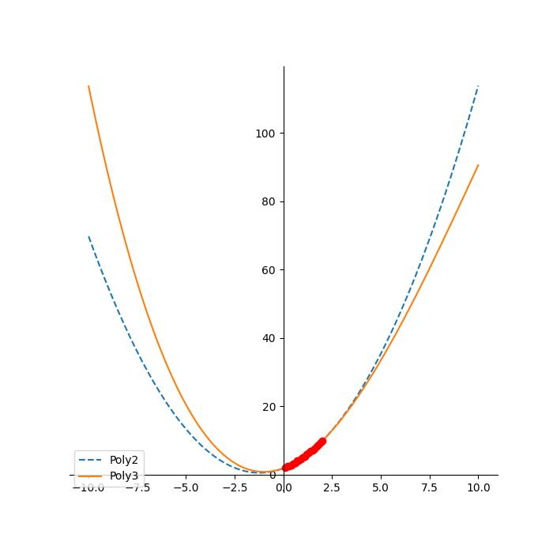
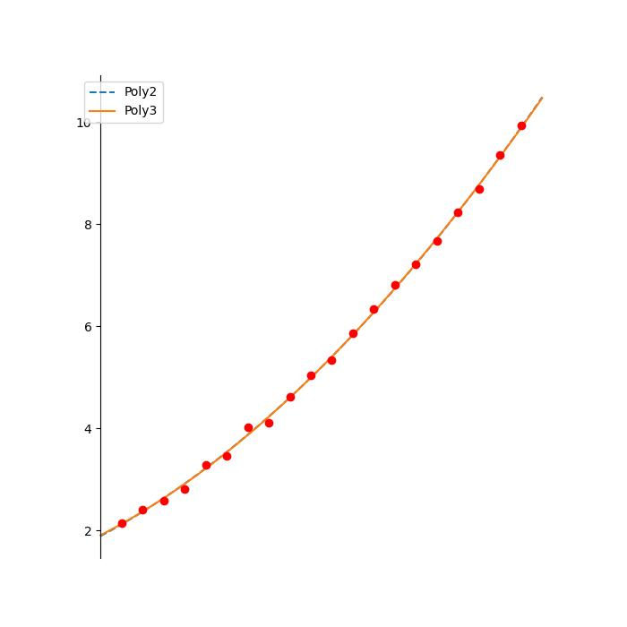

# Теория надёжности
Здесь хранятся лабараторны работы по дисциплине "Основы надежности технических систем и ее приложение к оценке ресурса ответственных инженерных объектов". Они представляют собой различные способы аппроксимации значений, полученных экспериментальным путём
# Структура репозитория
## `graphics`
Здесь находятся картиночки в формате .jpg с графиками полученных функций и исходных данных.
## `mls`
Лабораторная работа, посвящённая методу наименьших квадратов для аппроксимции данных. Здесь хранится:
- файл с входными данными `mls_data.txt`
- файл с тестами `test_mls.py`
- файл, реализующий МНК, `mls_algorythm.py`
Результат на предоставленных данных: 

<picture>
  <source media="(prefers-color-scheme: dark)" srcset="graphics/mls_all_dark.jpg">
  <source media="(prefers-color-scheme: light)" srcset="graphics/mls_all.jpg">
  
</picture>

<picture>
  <source media="(prefers-color-scheme: dark)" srcset="graphics/mls_points_dark.jpg">
  <source media="(prefers-color-scheme: light)" srcset="graphics/mls_points.jpg">
  
</picture>

## `regression`
Лабораторная работа, посвящённая методу линейной регрессии для аапроксимации данных. Здесь хранятся:
- файл с входными данными `reg_data.txt`
- файл с тестами `test_regression.py`
- файл с линейной регрессией `regression_algorythm.py`
Результат на предоставленных данных:

<picture>
  <source media="(prefers-color-scheme: dark)" srcset="graphics/regression_dark.jpg">
  <source media="(prefers-color-scheme: light)" srcset="graphics/regression.jpg">
  
</picture>
